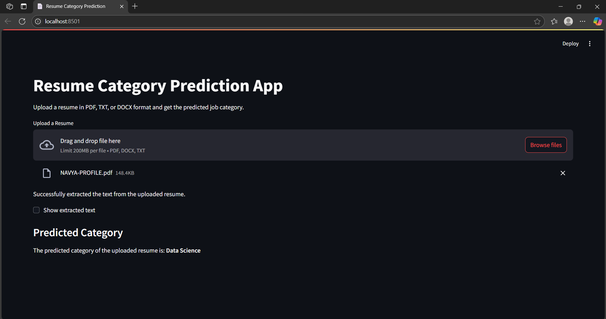

# Resume Screening App
A Streamlit web application that classifies uploaded resumes into job categories using Natural Language Processing (NLP) and machine learning. Users can upload a resume file in PDF, DOCX, or TXT format, and the app predicts the most likely category (like Data Science, HR, Testing etc.).

## Features
- Resume text Extraction
- Machine Learning Model to classify resume
- Supports PDF, DOCX, TXT

## Demo

